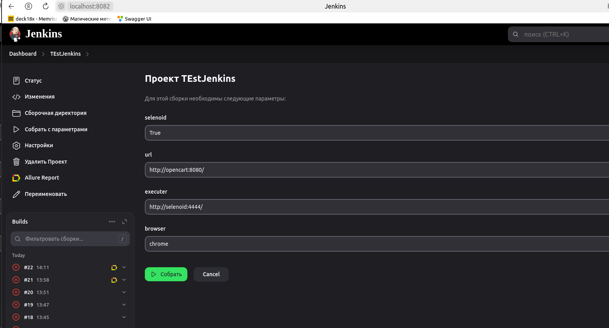
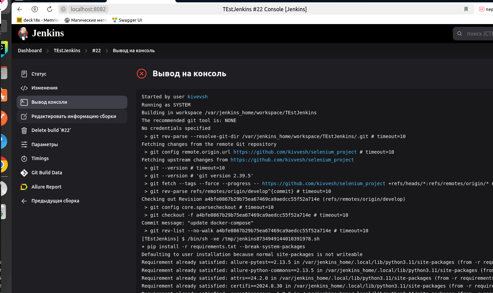
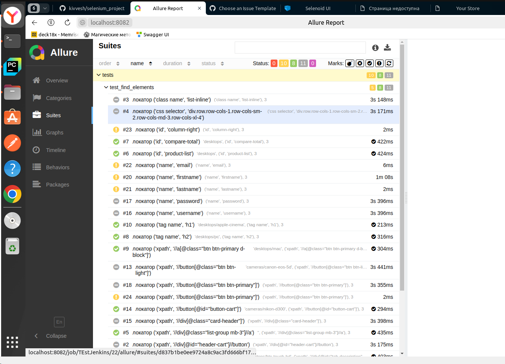

# selenium_project

## CI jenkins

1. `docker build -t -f jenkins/Dockerfile` - собираем образ jenkins с python
2.  `OPENCART_PORT=8089 PHPADMIN_PORT=8888 LOCAL_IP=10.0.2.15 docker compose up` - запускаем контейнеры Opencart, Selenoid
3. `docker run -d -p 8082:8080 -p 50000:50000 --network app-network myjenkins` - запускаем контейнер myjenkins в сети app-network
4. настраиваем jenkins, устанавливаем необходимые плагины, включая allure

pytest --headless=True --selenoid=True --url=http://opencart:8080/ --executer=http://selenoid:4444/

## Для запуска всервиса opencart, selenoid и тестов через docker-compose необходимо 

1. `hostname -I | awk '{print $1}'` - выясняем локальный ip
2. `OPENCART_PORT=8081 PHPADMIN_PORT=8888 LOCAL_IP=10.0.2.15 docker compose up` - запускаем контейнеры заменив LOCAL_IP на свой

## Запуск тестов в контейнере

1. `docker build -t tests .` собираем образ
2. `docker run -it tests -m scenario --browser firefox` запускам контейнер с тестами

## Запуск с помощью selenoid

`pytest -m scenario --selenoid=True --browser=chrome --browser_version=127`

## 1 часть
* Реализована передача браузера через параметр --browser и базовый url через --url
* Конструкция в фикстуре browser через yield закрывает браузер по завершению тестов
* Все тесты промаркированы в соответствии с их функционалом
 Пример запуска тестов `pytest -m smoke --browser=chrome`

## 2 часть
* В соответствии с требованиями написаны тесты, проверяющие наличия элементов
* Маркер для тестов find_element
* Тесты для 2 части находятся tests/test_find_elements.py
Пример запуска тестов для 2 части `pytest -m find_element --browser=chrome`

## 3 часть
* В соответствии с требованиями написаны тесты для покрытия некоторых сценарий
* Маркер для тестов scenario
* Тесты для 3 части находятся tests/test_scenario.py

Пример запуска тестов для 2 части `pytest -m scenario --browser=chrome`

## Дополнительно
* Реализован логгер для тестов, уровень логирования необходимо указывать 
configs/settings.py по ключу log_level или при запуске тестов через параметр 
--log_level (DEBUG, INFO, ERROR)
* Использована параметризация для проверки одной логике с разными данными
